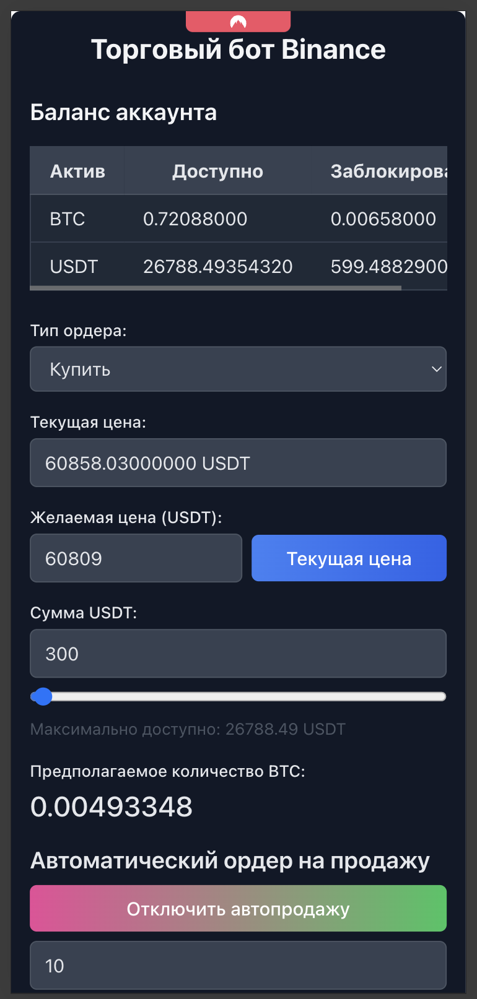
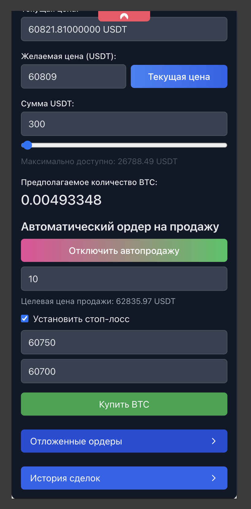

# Day Trader Dreammachine BTC (Binance)

This project is a trading bot for Binance, consisting of a React frontend and a Node.js backend using MongoDB as the database.
it trades BTCUSDT pair only for now </br>
### it allows to set autosell order with desirable profit
example: you setup order to buy portion of BTC (lets say 0.001BTC) for 2000 USDT and you can here set how much you whant to make when you sell this portion of BTC</br> say you want to make 100 USDT profit so when you buy 0.001BTC for 2000 USDT you can set autosell order to sell 0.001BTC for 2100 USDT
### how it works:
you create order for 2000 USDT and set autosell order for 2100 USDT
once the order is filled the bot will automatically sell the BTC when the price reaches the desired profit

## Prerequisites

- Node.js (version 14 or higher)
- npm (usually comes with Node.js)
- MongoDB

## Installation

### 1. Clone the repository

```bash
git clone https://github.com/your-username/binance-trading-bot.git
```

### 2. Install MongoDB

#### macOS (using Homebrew):

```bash
brew tap mongodb/brew
brew install mongodb-community
```

#### Windows:

Download and install MongoDB from the [official website](https://www.mongodb.com/try/download/community).

### 3. Install dependencies


# Install backend dependencies

```bash
cd backend
npm install
```

# Install frontend dependencies

```bash
cd frontend
npm install
```


### 4. Set up environment variables

Create a `.env` file in the `backend` directory with the following content:

```
BINANCE_API_KEY=your_binance_api_key
BINANCE_SECRET_KEY=your_binance_secret_key
AUTH_PASSWORD=authentication_password
MONGODB_URI=mongodb://localhost:27017/binance_bot
PORT=4000
HTTP_BASE=https://api.binance.com
```

Create a `.env` file in the `frontend` directory with the following content:

```
REACT_APP_AUTH_PASSWORD=authentication_password
```

Make sure the `AUTH_PASSWORD` in the backend matches the `REACT_APP_AUTH_PASSWORD` in the frontend.


## Running the project

### 1. Start MongoDB

```bash
mongod --config /opt/homebrew/etc/mongod.conf
```

or 

```bash
mongod
```
to kill mongod process use 
```bash
pkill mongod
```
or 
```bash
sudo lsof -i :4000
kill -9 <PID>
```

### 2. Start the backend server

```bash
cd backend
npm run dev
```

### 3. Start the frontend server

```bash
cd frontend
npm start
```

### Main screen<br>



